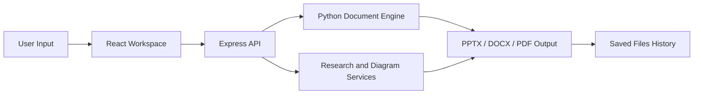
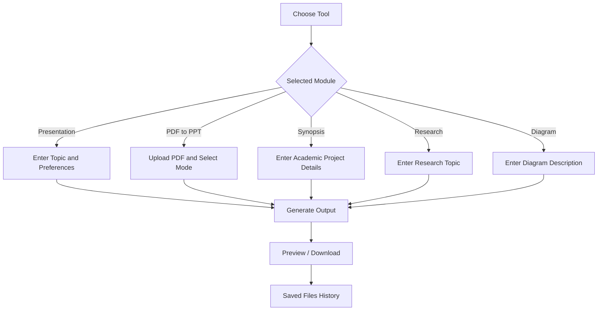

# PresentMind AI

**AI-powered presentation, academic synopsis, PDF-to-PPT, research and diagram generation platform.**

[**View Source Code**](https://github.com/Vishal619-dubey/PresentMind-AI) • **Live Demo: Coming Soon**


## Overview

PresentMind AI is a full-stack academic productivity platform designed to help students, researchers and professionals create polished presentations, convert documents, generate academic reports and organize generated files from one workspace.

The application combines a React-based frontend, a Node.js and Express backend, and a Python document-generation engine. It supports presentation creation, PDF-to-PPT conversion, long-form synopsis generation, research assistance, Mermaid diagrams and downloadable output files.

## Why PresentMind AI?

Students often need separate tools for creating presentations, writing academic documents, generating diagrams and converting PDFs. PresentMind AI brings these workflows together into one integrated platform.



## Core Features

### AI Presentation Generator

- Generate structured presentations from a topic or prompt.
- Create slide titles, bullet points and organized content.
- Produce downloadable PowerPoint files.
- Support academic, business and general presentation use cases.

### PDF to PowerPoint Converter

#### Smart Editable Mode

- Extracts headings and important text from PDF pages.
- Converts content into editable PowerPoint slides.
- Adds page previews for reference.
- Useful when users want to modify the generated slides.

#### Exact Visual Mode

- Converts PDF pages into slide-sized visuals.
- Preserves the original page appearance.
- Useful for page-perfect presentations and document previews.

### Academic Synopsis Generator

- Generates long-form academic synopsis documents.
- Supports DOCX and PDF output.
- Includes cover page, declaration, contents, abstract, architecture, database design, methodology, testing, work plan, future scope and references.
- Designed to produce a substantial academic document instead of a short summary.

### Research Assistant

- Helps organize research ideas and academic content.
- Supports structured topic exploration.
- Produces useful content for reports, presentations and project documentation.

### Diagram Generator

- Generates Mermaid-based diagrams from user input.
- Supports flowcharts, system architecture, process diagrams, data flow diagrams and research workflows.
- Useful for project reports and presentations.

### Generated Files History

- Stores references to generated output files.
- Allows users to review and download previous files.
- Keeps presentation, synopsis and conversion workflows organized.

## Application Workflow



## Technology Stack

| Layer | Technologies |
|---|---|
| Frontend | React, Vite, JavaScript, responsive CSS |
| Backend | Node.js, Express.js |
| Document Engine | Python |
| Presentation Output | PPTX generation workflow |
| Academic Documents | DOCX and PDF generation |
| PDF Processing | PDF extraction and visual conversion |
| Diagrams | Mermaid |
| File Management | Generated file storage and history |
| Development Tools | Git, GitHub, VS Code, npm, pip |

## Project Structure

```text
PresentMind-AI/
├── client/                 # React + Vite frontend
│   ├── src/                # Pages, components and application logic
│   ├── public/             # Static assets
│   └── .env.example        # Frontend environment example
│
├── server/                 # Node.js + Express backend
│   ├── routes/             # API routes
│   ├── controllers/        # Request handlers
│   ├── services/           # Core application services
│   └── .env.example        # Backend environment example
│
├── python_engine/          # Python generation engine
│   ├── requirements.txt    # Python dependencies
│   └── generation scripts  # PPT, PDF, DOCX and processing logic
│
├── test-output/            # Local generated test files
├── package.json            # Root development scripts
└── README.md
```

## Local Installation

### Prerequisites

- Node.js
- npm
- Python 3
- pip
- Git

### 1. Clone the Repository

```bash
git clone https://github.com/Vishal619-dubey/PresentMind-AI.git
cd PresentMind-AI
```

### 2. Install Node.js Dependencies

```powershell
npm run install-all
```

### 3. Install Python Dependencies

```powershell
python -m pip install -r python_engine\requirements.txt
```

### 4. Create Environment Files

Windows PowerShell:

```powershell
Copy-Item server\.env.example server\.env
Copy-Item client\.env.example client\.env
```

macOS or Linux:

```bash
cp server/.env.example server/.env
cp client/.env.example client/.env
```

### 5. Start the Application

```powershell
npm run dev
```

Open:

```text
http://localhost:5173
```

## Available Modules

| Module | Input | Output |
|---|---|---|
| Presentation Generator | Topic or prompt | PPTX presentation |
| PDF to PPT - Smart Editable | PDF document | Editable PPTX |
| PDF to PPT - Exact Visual | PDF document | Visual PPTX |
| Synopsis Generator | Academic project information | DOCX and PDF |
| Research Assistant | Research topic | Structured research content |
| Diagram Generator | Diagram description | Mermaid diagram |
| File History | Generated outputs | Downloadable file list |

## Recommended Testing Flow

1. Start the frontend, backend and Python engine.
2. Generate a small presentation from a topic.
3. Upload a PDF in Smart Editable mode.
4. Upload the same PDF in Exact Visual mode.
5. Generate a synopsis in DOCX and PDF formats.
6. Create a Mermaid diagram.
7. Test the research assistant.
8. Open generated files history and download each output.

## Deployment Plan

- Frontend: Netlify
- Backend: Render
- Python generation engine: bundled with the backend deployment
- Environment variables: configured separately on each platform

The live demo link will be added after deployment is completed.

## Security and Repository Hygiene

- `.env` files are excluded from version control.
- `node_modules` and other dependency folders are ignored.
- Generated files and temporary uploads should not be committed.
- Public example environment files are included for setup guidance.
- API keys and secrets must be stored only in environment variables.

## Future Improvements

- User authentication and private workspaces
- Cloud-based generated file storage
- More presentation themes and templates
- Slide-level editing inside the browser
- Citation and bibliography generation
- Export diagrams as PNG and SVG
- Collaboration and shared projects
- Presentation analytics and version history
- Additional academic document templates

## Learning Outcomes

This project demonstrates practical experience with:

- Full-stack application development
- React and Node.js integration
- Python-based file generation
- PDF processing
- PowerPoint and document automation
- API-driven architecture
- File upload and download workflows
- Mermaid diagram generation
- Git and GitHub version control
- Deployment planning for multi-runtime applications

## Author

**Vishal Dubey**  
AI & Full-Stack Developer

- GitHub: [Vishal619-dubey](https://github.com/Vishal619-dubey)
- LinkedIn: [vishal-dubey-ai](https://www.linkedin.com/in/vishal-dubey-ai)

## Support

If you find this project useful, consider giving the repository a star.